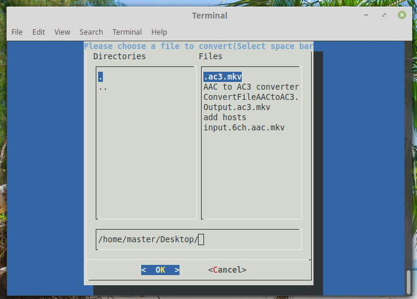

# ConvertAACtoAC3.sh
Convert AAC 6 ch to AC3 6 ch with ffmpeg (linux)

An easy way to convert audio (with video) AAC 6 channels to AC3 6 channels.

Features
--------

-Use ffmpeg. (Installed by default in most Linux distros)

-Use command line.

-The video was copied the audio was converted. (No change to video)

How to ?
--------

-Save ConvertFileAACtoAC3.sh where you want.

-Make it executable.

-Double click on it. (Use file from Desktop)

-Select a file with the space bar and press enter.

I consider myself as a new in linux bash and if you're not happy make it yourself. :)
