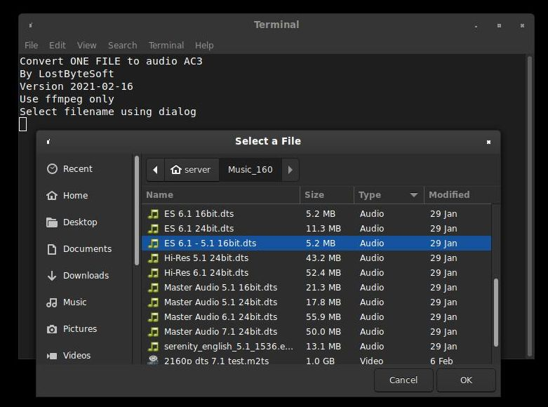

Features
--------

-Use ffmpeg. (Installed by default in some Linux distros)

-Use command line.

-The video was copied the audio was converted. (No change to video)

-Convert audio files (6 channels) to AC3 6 channels. (Wav, Aac, Dts)

-DTS conversion is now considered stable (in most cases) , just try it before use.

-Convert AAC 6 ch to AC3 6 ch with ffmpeg (linux).

-Convert AAC or anothe audio files.

-An easy way to convert audio (with video) AAC 6 channels to AC3 6 channels. It's just a bash script to use ffmpeg.

-Use Zenity to find your files.

Easy bash files:
--------

#Convert all file in folder into MP3 -> ConvertALLfolderMP3.sh

#Convert all files in FLAC folder into MP3 -> ConvertFLACfolderMP3.sh

#Convert XXX selected to AAC -> ConvertXXXtoAAC.sh

#Convert XXX selected to AC3 -> ConvertXXXtoAC3.sh

#Convert XXX selected to DTS -> ConvertXXXtoDTS.sh

#Convert XXX selected to MP3 128kb -> ConvertXXXtoMP3 128.sh

#Convert XXX selected to MP3 320kb -> ConvertXXXtoMP3 320.sh

How to ?
--------

-Make it executable.

-Double click on it, select your file.

-Select a file and press enter.

Specials & Extras
--------

#Extract Srt From Mkv -> extractSRTfromMKV_choosefile.sh

#Extract Srt From Mkv -> extractSRTfromMKV_samefolder.sh

-Extract subtitles SRT from each MKV file in the given file.

-Extract subtitles SRT from each MKV file in the given directory.
	-WILL DO ALL MKV FILES IN THE DIRECTORY

-Could extract not the language you want if many is present.

-turn video into 90 degree -> turn-video-90.sh

--------

Version 2021-02-16

--------

	*How to correctly name a multimedia video file.

    Movie.Title.year.{Source.VideoCompression.AudioCompression}.ext
    Movie.Title.year.{Source.VideoCompression.AudioCompression}.language.srt

    {Br.2160px265.audio}
    {Br.1080pX264.Dts51}
    {Br.1080pX264.Ac351}
    {Br.1080pX264.St}
    {Br.720pX264.Ac351}
    {Br.720pX264.Ac320}
    {Dvd.480X264.Ac351}
    {Dvd.480X264.St}
    {Tv.SdX264.St}

	*Source:

    Br      Blu-Ray source
    Dvd     Dvd source
    Tv      Tv or other low resolutions sources

	*VideoRes:

    2160p   4k , uhd , 3840 x 2160 , 2160p (4k bluray)
    1080p   1080, p or i (bluray)
    720p    720, p or i (dvd)
    480i    480, p or i
    Sd      tv, lower than 480 p/i or other low resolutions sources

	*AudioRes:   (Dts and Ac3 is supported in linux/windows)

    AtTr    Atmos TrueHd (5.1 or more)
    Dts71   Dts 7.1 / Dts-hd 7.1
    Dts6.1  Dts 6.1
    Dts51   Dts 5.1 or Dts-hd 5.1 (2.0 or more)
    Ac351   Ac3 5.1 (5.1 or more)
    Ac320   Ac3 is provide as 1.0 to 5.1
    St      Stereo (always 2.0)
    Mo      Mono (always 1.0)

	*Extension:

    eng     Language, only original language (Used for subtitles)
    srt     subtitles

	*Exemples:

    Die.Hard.1988.{Br.4kx26510b.Dts51}.mkv
    Die.Hard.1988.{Br.4kx26510b.Dts51}.eng.srt
    Die.Hard.1988.{Br.4kx26510b.Dts51}.fra.srt
    Jurassic.Park.1993.{Br1080px264.Ac351}.avi
    Jurassic.Park.1993.{Br1080px264.Ac351}.eng.srt
    Jurassic.Park.1993.{Br1080px264.Ac351}.chn.srt
    
    VLC will auto load theses srt files; same name of the video file.

--------

