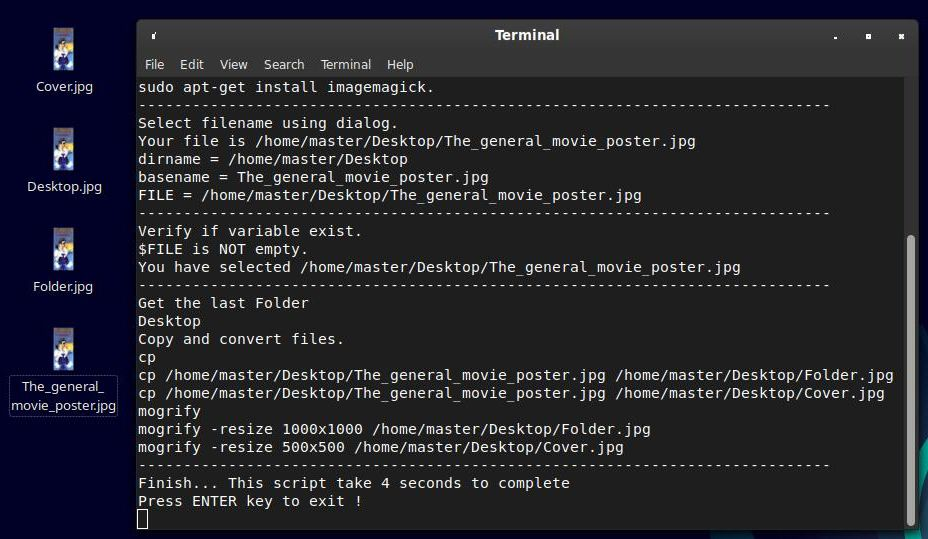

LostByteSoft ; ConvertFFMPEG

Convert or modify multimedia files with FFMPEG.

Features:
---------------------------------------------

Audio, video & images at different level.

-Convert multimedia files, audio and video to standart format.

-Use ffmpeg. (Installed by default in some Linux distros)
	If not sudo apt-get install ffmpeg

-Use Zenity to find your files.

-Use command line, for conversions.

-It's just a bash script for easy use ffmpeg.

-Convert audio files (6 channels) to AC3 6 channels. (Wav, Aac, Dts, Flac)

-Convert AAC or another audio files.

-An easy way to convert audio (with video) AAC 6 channels to AC3 or DTS 6 channels.

-Convert video to x264 and x265.

History: I start this "thing" just for convert aac 6 ch to ac3 6 ch and became what it is now.

How to ?
---------------------------------------------

-Make it executable.

-Double click on it, select your file and press enter.

	
Converters files:
---------------------------------------------

-Single core ffmpeg (You can start many of theses sh files)

	Convert ALLfolderAC3.sh
		-All files in folder will be converted to AC3.
	Convert ALLfolderMP3 128.sh
	Convert ALLfolderMP3 320.sh
	Convert FLACfolderMP3.sh
		All .Flac files in folder will be converted to Mp3 in 320kbps.
	Convert XXX to AACC.sh
	Convert XXX to AC3.sh
		-An easy way to convert audio (with video) AAC 6 channels to AC3 6 channels.
	Convert XXX to DTS.sh
		-DTS conversion is now considered stable (in most cases) , just try it before use.
	Convert XXX to MP3 320.sh
		
	Convert HDRtoSDR.SDR-x264-10b-ac3-48000hz-640k.sh
	Convert HDRtoSDR-SDR-x264-10b-copy.sh
	Convert HDRtoSDR-SDR-x264-10b-no-audio.sh
		-Convert VIDEO HDR to SDR, for thoses who don't have HDR display.
		-NO audio, ac3 or copy in final file. Use MKVtoolNIX or something else.
		-HDR or HDR10 or HDR10+
		-Will need to recode all file (Takes long time).
		-You can find HDR and HDR10 files here https://4kmedia.org/

		
	Convert XXX to 720p-x264-8b-30f.aac-2.0-44100hz.sh
		-Excellent small format for facebook.
	Convert XXX to 2160p-x264-10b-30f.dts-48000hz.sh
		-HD 4k upscale or downnscale
		-Takes 1 hour (ages) to downscale an 8k video of 2 min lengt.
		
-Parallel ffmpeg (Uses all cores or select the numbers of cores you want)

	Convert ALL folder 720p-x264-8b-30f.aac (parallel).sh
	Convert ALL folder AC3 (parallel).sh
	Convert ALL folder MP3 320 (parallel).sh
		-Need ffmpeg and parallel to work.
	
Creator files:
---------------------------------------------

	creator CoverFolder.sh
		-Take an image file (movie poster) and convert it to:
		Cover.jpg an 500x500 px
		Folder.jpg an 1000x1000 px
		Name of folder reside in.jpg 1000x1000px
		For music and movie folder.
		
	creator playlist all m3u in subfolder.sh
		Create m3u in subfolder only.
	creator playlist all music here.sh
		Takes all mp3 find in subfolder and create m3u here.
	creator playlist mp3 m3u.sh
		-Create an m3u list for the specified folder.
		-Only mp3 ... but you can change it in file.
		
		

Extractor files:
---------------------------------------------

	extract SRTfromMKV_choosefile.sh
		-Exttract SRT files from a video, only extract first SRT if many present.
	extract SRTfromMKV_samefolder.sh
		-Exttract SRT files from all video files in folder.

test files:
---------------------------------------------

	testfile.aac51.mkv
		-Audio in .mp4a (aac 6 ch), so you can test with this file for convert, extract or turn.
		
Others files:
---------------------------------------------

	turn-video-90.sh
		-Turn an video 90 deg angle.
		-The video was turned the audio was copied.

---------------------------------------------

Version 2021-02-16 - File converter - Convert XXXtoAC3

Version 2021-12-15 - Folder and Cover - creator CoverFolder

---------------------------------------------

Suggested ram size to convert (hd) video files:

	720p -> 4gb
	1080p -> 8gb
	4k -> 16 gb
	8k -> 32 gb
	
Bitrate (normal std):

	Cd -> 1.411k 16b 44100khz
	Ac3 -> 640k 48000khz (Created 1987)
	Dts -> 768k and 1536k 48000khz (Created 1993)
	AAC -> 448k 48000 khz (Created 1997)
	Dts-hd -> 1536k 24b 48000khz
	
	Sample rate:
	AAC: 8 to 192 kHz
	AC3: 32, 44.1, 48 kHz

	Bitrate:	
	AAC: 8-529 kbit/s (stereo)
	AC3: 32-640 kbit/s 
	
Resolutions:

	Dvd -> 720 x 480
	Hd -> 1280 x 720
	Hd -> 1920 x 1080
	4K -> 3840 x 2160
	8K -> 7680 x 4320

---------------------------------------------

	*How to correctly name a multimedia video file.
	
	source video and audio separated by an . (dot)
	Video and audio data separated by - (dash)
	
    Movie.Title.year.Source.Video-Compression.Audio-Compression.ext
    Movie.Title.year.Source.Video-Compression.Audio-Compression.language.srt

    Br.8k-x266-12b-60f.Atmos-12.2
    Br.2160px265.audio
    Br.1080pX264.Dts51
    Br.1080pX264.Ac351
    Br.1080pX264.St
    Br.720pX264.Ac351
    Br.720pX264.Ac320
    Dvd.480X264.Ac351
    Dvd.480X264.St
    Tv.SdX264.St

	*Source:

    Br      Blu-Ray source
    Dvd     Dvd source
    Tv      Tv or other low resolutions sources

	*VideoRes:

    4320p   8k
    8k
    2160p   4k , uhd , 3840 x 2160 , 2160p (4k bluray)
    4k
    1080p   1080, p or i (bluray)
    720p    720, p or i (dvd)
    480i    480, p or i
    Sd      tv, lower than 480 p/i or other low resolutions sources

	*AudioRes:   (Dts and Ac3 is supported in linux/windows)

    Atmos   Atmos TrueHd (5.1 or more)
    DtsHd   Dts 7.1
    DtsEx   Dts 6.1
    Dts51   Dts 5.1 or Dts-hd 5.1 (2.0 or more, max 5.1)
    Ac351   Ac3 5.1
    Ac320   Ac3 2.0 (Ac3 could be 1.0 to 5.1)
    St      Stereo (always 2.0)
    Mo      Mono (always 1.0)

	*Extension:

    eng     Language, only original language (Used for subtitles)
    srt     subtitles

	*Exemples:

    Dune.2021.8k-x266-12b-60f.Atmos-12.2.mkv
    Die.Hard.1988.Br.4kx26510b.Dts51.mkv
    Die.Hard.1988.Br.4kx26510b.Dts51.eng.srt
    Die.Hard.1988.Br.4kx26510b.Dts51.fra.srt
    Jurassic.Park.1993.Br1080px264.Ac351.avi
    Jurassic.Park.1993.Br1080px264.Ac351.eng.srt
    Jurassic.Park.1993.Br1080px264.Ac351.chn.srt
    
    VLC will auto load theses srt files; same name of the video file.

---------------------------------------------

	JUST DO WHAT YOU WANT WITH THE PUBLIC LICENSE

	Version 3.1415926532 (January 2022)

	TERMS AND CONDITIONS FOR COPYING, DISTRIBUTION AND MODIFICATION
   
	Everyone is permitted to copy and distribute verbatim or modified copies of
	this license document.

	As is customary and in compliance with current global and interplanetary
	regulations, the author of these pages disclaims all liability for the
	consequences of the advice given here, in particular in the event of partial
	or total destruction of the material, Loss of rights to the manufacturer
	warranty, electrocution, drowning, divorce, civil war, the effects of radiation
	due to atomic fission, unexpected tax recalls or encounters with
	extraterrestrial beings elsewhere.

	LostByteSoft no copyright or copyleft we are in the center.

--------------------------------------------------------------------
# --- End of file ---

